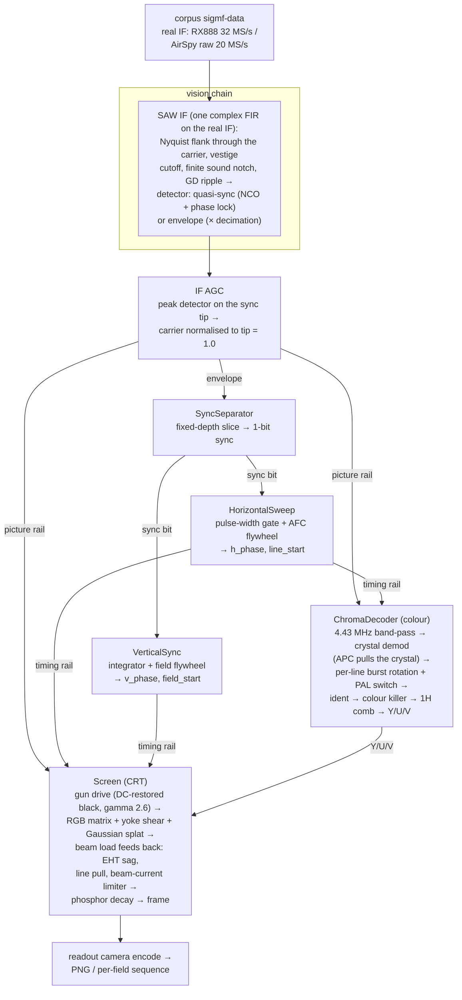

## PALindrome

Decode real PAL RF - captured off a console with an SDR - the way a 1980s
television did, to recreate that authentic 1980s/1990s look. (The eventual goal
includes encoding back to PAL for emulators; the `encode`/`decode` subcommands
are stubs today - `render` is the working end.)

## Where we're at

PALindrome ingests a lossless RF/IQ master of a real PAL source (captured off a
console via an SDR) and decodes it the way a 1980s television would - as an
analog machine, not a DSP textbook. The current state:

- **Capture** from an RX888 or an AirSpy R2 - both real-sampled IF (the AirSpy
  in its raw 20 MS/s mode), saved as SigMF masters under `corpus/`. Both decode
  through the same pipeline.
- **`demod`** - AM-demodulates the vision carrier to a WAV for inspection.
- **`render`** - a **working sync-locked decode, in colour** (`--colour`) or
  monochrome: a streaming video graph that separates sync, locks horizontal and
  vertical timebases with flywheel PLLs, decodes the PAL chroma (a faithful
  PAL-D channel - burst-locked crystal, PAL-switch ident, 1H comb), and paints the
  beam onto a phosphor screen modelled as an analog set - a rotated deflection
  yoke (straight scanlines), a Gaussian beam spot, and an electron gun whose
  cutoff is set by the DC-restored black level. The defaults are
  period-faithful: tube gamma 2.6, overscan framing, EHT sag and beam-current
  limiting under load, an ident-driven colour killer, an APC that pulls the
  crystal - with the modern conveniences kept behind flags.
  Interlace falls out of the half-line field offset; `--frame-stride` dumps a
  per-field PNG sequence.
- **`tools/inspect_capture.py`** - fast capture QC: predicts whether a clip is
  decodable (carrier/sideband reach, line-comb SNR) and flags near-carrier ghost
  spurs, before you sink time into a full decode.
- **`tools/tune.py`** - a web UI (slider per knob, frame scrubber) that shells
  out to `render` so you can dial the decode/CRT/colour knobs in live. It lives
  outside the C++ core - the decoder stays a plain CLI with no webserver in it.
- **`sync`** - a diagnostic that slices the composite and reports the pulse-width
  distribution, line-sync jitter, vertical field structure, and the locks the
  timebases settle on. This is the microscope the decode was built with.

The picture is a clean, recognisable image - true blacks, straight geometry,
filled scanlines - and **in colour** (`render --colour`): a PAL-D chroma channel
recovers U/V off the burst and drives an RGB phosphor triad. Levels are period-
correct and ABSOLUTE: a sync-tip IF AGC normalises the carrier, white is the
broadcast standard's geometry (not a measurement of picture content), the ACC
references chroma to it, blanking hides the retrace, and the RGB matrix matches
the TDA3561A datasheet. Both SDRs decode
colour with the same default burst gate - the AirSpy's old per-SDR skew was a
10 MS/s near-Nyquist artifact, gone now it captures the channel at 20 MS/s.

## Building

Needs CMake 3.30+, Ninja, and g++-15 (pinned by `cmake/toolchains/gcc.cmake`;
the project is C++26). All third-party dependencies arrive via CPM (see Notes) -
no system packages. The `corpus/*.sigmf-data` masters are git-LFS objects, so
`git lfs pull` before decoding anything.

```
cmake --preset release && cmake --build --preset release
ctest --preset release
build/release/cli/palindrome render corpus/wb3_airspy --colour -o /tmp/wb3.png
```

Presets: `debug`, `release` (RelWithDebInfo, LTO, `-march=native`), and
`sanitize` (ASan+UBSan).

## Capturing reference clips

Two SDRs, two conventions. Both write a self-describing SigMF pair
(`<name>.sigmf-data` + `<name>.sigmf-meta`) under `corpus/`; the lossless RF/IQ
master is kept, not demodulated composite, so everything downstream is
reconstructible from it. `corpus/*.sigmf-data` are large binaries, tracked with
git LFS.

### RX888 (real-sampled IF)

`tools/capture_corpus.py` drives `rx888_stream` (the matt-main fork - see below).
Real samples, Nyquist `fs/2`; at 32 MSps the whole stack (vision IF ~3.6 MHz,
chroma +4.43, sound +6.0) fits with room to spare. Carriers are absolute IF bins
in the `rx888:*` metadata.

```
python3 tools/capture_corpus.py wb3 \
  --firmware ~/dev/rx888_stream/SDDC_FX3_v22.img \
  --source "Sega Master System II, Wonder Boy III, UK PAL"
```

Needs `rx888_stream` (built `--release` from
https://github.com/mattgodbolt/rx888_stream/tree/matt-main, with the FX3
shutdown/self-heal fixes), the FX3 firmware `.img`, and `python3` + `numpy`.
Defaults: 32 MSps, 12 frames, tuned ~0.5 MHz below the vision carrier with
front-end-heavy gain. Flags: `--sample-rate`, `--frequency`, `--vhf-lna`,
`--vhf-vga`, `--frames`, `--outdir`.

### AirSpy R2 (raw real, 20 MS/s)

`tools/capture_airspy.py` drives `airspy_rx` (stock firmware, no FX3 juggling) in
its **raw real** mode (`-t 3`): the chip's untouched ADC stream, real-sampled at
**20 MS/s** - twice the 10 MS/s of the firmware's complex-baseband mode, and
before its decimation filter. The extra rate is what makes PAL **colour**
decodable: at 10 MS/s the 4.43 MHz subcarrier sits at 0.886·Nyquist (its upper
sideband clips, the 2·fSC demod image folds into the chroma); at 20 MS/s it's
comfortably mid-band. Real samples carry a mirror of the carrier at minus-its-
frequency, so we tune the vision carrier to ~3 MHz IF (chroma ~7.4, sound ~9 -
the whole channel fits below the 10 MHz Nyquist) where the mirror clears the
vision band, and the decoder's one-sided front end deletes it. Same
real-IF convention as the RX888: carriers are absolute IF bins in `airspy:*`.

```
python3 tools/capture_airspy.py wb3 \
  --source "Sega Master System II, Wonder Boy III, UK PAL"
python3 tools/inspect_capture.py corpus/wb3   # QC before decoding
```

Needs `airspy_rx` (from `airspy-tools`) on `$PATH` and `python3` + `numpy` (+
`scipy`/`pillow` for `inspect_capture.py`). Defaults: 20 MS/s real, **gain 9**,
25 frames (1 s). Flags: `--frequency` (the source's vision carrier; we tune
~2 MHz below it), `--gain`, `--frames`, `--sample-rate`.

**Gain 9, not higher.** Counter-intuitively, a front-end-heavy gain (≥13)
overdrives the AirSpy into an intermodulation product: a coherent, video-bearing
*ghost* of the vision carrier ~fs/70 away, ~17 dB down. It beats into the AM
envelope as drifting vertical bars and renders the decode unrecognisable - all
while the ADC clip percentage reads 0%. `inspect_capture.py` flags it; `g9`
clears it with the best line-comb SNR.

## Decoding

### `render` - the picture

`palindrome render corpus/wb3 -o /tmp/wb3.png` decodes a recording to a PNG.
The signal flows through a streaming, branching video graph modelled on the
analog set:



The TLAs, for anyone whose shelf lacks a 1980s TV service manual:

- **IF** - intermediate frequency: the SDRs capture the whole modulated channel
  at a low centre frequency, exactly what a set's tuner hands its IF strip.
- **SAW** - surface acoustic wave filter: the one fixed component that shaped a
  set's IF response from the late 70s on. Its curve - flank, chroma shoulder,
  sound notch, group-delay ripple - is most of a set's RF personality, which is
  why ours is a swappable template (`--if saw80|saw90|flat`).
- **VSB** - vestigial sideband: TV AM keeps the full upper sideband but only a
  1.25 MHz vestige of the lower. The receiver's *Nyquist flank* puts the carrier
  at exactly -6 dB so each sideband pair sums back to flat video - and once that
  flank exists, where the carrier sits on it is load-bearing (hence AFC, later).
- **AGC** - automatic gain control: levels the received signal so the rest of
  the chain sees a constant amplitude regardless of signal strength. Ours
  peak-detects the sync tip (the carrier peak, under negative modulation) and
  holds it at 1.0, which is what makes every level downstream absolute.
- **APC** - automatic phase control: the burst phase detector that pulls the
  4.43 MHz reference (here, the crystal itself) into lock with the colourburst.
- **ACC** - automatic colour control: gain levelling for the chroma path,
  referenced to the burst, so saturation doesn't ride the signal strength.
- **ident** - the 7.8 kHz half-line-rate component of the swinging burst that
  tells the decoder which PAL line phase it's on; doubles as the colour
  killer's "this really is PAL" verdict.
- **1H** - one horizontal line period (64 µs): the "1H delay line" is the glass
  block that delays chroma exactly one line so adjacent lines can be averaged.
- **EHT** - extra-high tension: the final-anode supply (~25 kV) that
  accelerates the beam into the phosphor. It's poorly regulated, so beam
  current loads it down - the raster breathes on bright scenes.
- **NCO** - numerically controlled oscillator: the digital stand-in for an
  oscillator (here, the crystal the APC pulls).

Every stage is a streaming block (`prepare` / `process(span)→span`, state carried
across calls), so the output is independent of how the input is chunked - a
tested invariant, because the target is live RF, not finite files. The whole
graph is a `video::Decoder` composite node. `render` pumps it 64K-sample blocks
and, by default, runs the stages as a **threaded pipeline**: the front-end,
decode and screen deposit each on their own thread, a block apart, with owned
buffers passed through bounded pools so memory stays bounded (the live-streaming
shape). It's built on stdexec (`std::execution` / P2300) FIFO stages and is
bit-identical to the serial path; `--no-threads` forces serial decode.

Flags: `--width`, `--height`, `--decimate` (`0` = auto: the largest decimation
that keeps the 4.43 MHz subcarrier below ~0.7·Nyquist - RX888 32 MS/s → /2,
AirSpy 20 MS/s → /1; pass a number to override), `--carrier`, `--cutoff`,
`--sync-cutoff` (the narrow low-pass on the sync-detection branch), and the CRT
knobs `--persistence` (phosphor decay, in field periods), `--beam-sigma`
(beam-spot size, in scanline pitches; `--beam-sigma-x` sets the horizontal
size separately, in output columns), `--gamma` (the electron-gun curve, default
2.6 - a real tube), `--readout-gamma` (the "camera" between the phosphor and
the PNG: the framebuffer is linear light, so the readout encodes it for a
display that will decode at ~2.2; `1` writes raw linear light, the old
double-gamma'd look), `--overscan` (default 0.06: the nominal active picture,
cropped that fraction behind the bezel, fills the frame as on a real set -
blanking lives off-screen; negative restores the old full-scan framing),
`--h-shift`/`--v-shift` (the centring adjustments - internal service pots on
a real set, so the factory-default framing should be right without them: the
default visible window starts ~1 µs before active video, the framing consoles
relied on to keep their left edge on screen), and
`--frame-stride` (write a PNG every Nth field as `<stem>_NNNN.png` instead of a
single image). PNGs are encoded fast (uncompressed) rather than small - this is a
research tool that throws most of them away. The old default look is exactly
`--gamma 1.5 --overscan -1 --readout-gamma 1 --eht-sag 0 --line-pull 0 --bcl 0
--agc adaptive --if flat` (adaptive mode also flips the contrast/saturation
defaults back to their pre-AGC values and sidelines the peak-white limiter,
which needs absolute levels).

The carrier reaches the detector through a set's IF curve, not an ideal
filter: `--if saw80` (the default) realises an early-80s single-SAW receiver
response as one complex-coefficient FIR applied straight to the real IF - the
Nyquist flank through the carrier (so the vestigial-sideband pairs sum back to
flat video), the vestige cutoff, chroma a few dB down on the shoulder rolling
toward the sound notch, and that notch deliberately FINITE (`--sound-notch-db`,
default 26: an intercarrier set needs sound carrier left at the detector, and
the residue is a real 6 MHz beat in the video), plus the SAW's signature
group-delay ripple (`--gd-ripple`, default ±50 ns: faint pre/post-ringing next
to sharp edges). Being one-sided, the same taps delete the real capture's
negative-frequency carrier image - the job the Hilbert stage did - at the cost
of exactly the two real convolutions the old symmetric low-pass pair spent.
`--if saw90` is a 90s set (flat through chroma, -40 dB notch, near-clean
phase); `--if flat` keeps the ideal pre-SAW chain, bit-for-bit.

After the SAW comes the detector. `--detector quasi-sync` (the default) is
the TDA-era product detector: an NCO at the carrier with a slow phase lock
nulling the mean quadrature - the digital stand-in for the demodulator IC's
high-Q tank - whose in-phase product is the video. It is linear through
overmodulation (the output swings negative rather than folding) and free of
the VSB quadrature distortion an envelope detector folds in on the flank's
asymmetric sidebands. `--detector envelope` is the diode detector of the
earlier sets: the magnitude, quadrature fold-through and rectified overshoots
included. (`--if flat` is always the envelope - it's the legacy chain.)

The front end has to be told where the carrier is, and once the IF curve has a
sloped flank, where it sits on that flank is load-bearing. The carrier comes
from the metadata when the recording carries it, but the decoder can also find
it itself: a coarse FFT scan of the opening ~50 ms picks the dominant line (the
vision carrier sits at the sync-tip peak and is present even in blanking),
refined to a few hundred Hz - comfortably inside the quasi-sync loop's pull-in,
which takes it the rest of the way. That runs automatically when a recording has
no carrier metadata, and `--scan` forces it even when metadata is present -
which doubles as a check on the metadata's own number and as the bench tuning
aid for re-measuring a source's channel (the live path itself never scans:
it is tuned by `--carrier`, like a set).

Levels are absolute, the way a receiver actually knows them: an IF AGC
(`--agc sync-tip`, the default) peak-detects the carrier's sync tip - under
negative modulation the tip IS peak carrier - and holds it at 1.0, so the
sync separator slices at a fixed depth below it (`--slice-depth`, default
0.08: inside both broadcast sync, 0.24 deep, and the much shallower sync of
console RF modulators), black is the clamped back porch, and white is the
transmission standard's GEOMETRY - System I puts blanking at 76% and peak
white at 20% of the tip - not a measurement of whatever the picture happens
to contain. `--contrast` is then the real pot: video gain ahead of the gun.
The SMS corpus under-modulates (its white only reaches ~50% carrier), so a
period set shows it dim and the default ships with the pot turned up
(`--contrast 1.6`, provisional until more sources exist to level-set
against); broadcast-standard modulation wants 1.0. `--agc adaptive` restores
the old scheme - per-stage trackers that stretch whatever arrives to full
range (an autocontrast no real set had), with `--contrast` back at its old
readout meaning and `--sync-level` placing the adaptive slice. `render`
prints the front-end gain it settled on.

The set protects itself, too: `--bcl` (default 0.7) is the beam-current
limiter - when the average beam load exceeds it, the set pulls its own
contrast down until the load settles at the threshold, so a sustained bright
scene dims rather than cooking the tube (0 = an unprotected set). Its
companion `--pwl` (default 1.25) is the TDA3561A's peak-white limiter: when
any gun's drive exceeds that multiple of standard white for more than a line
(one line of grace, so an abrupt colour-to-white test pattern never trips
it), the contrast is pulled down fast until the peak sits at the ceiling,
recovering slowly when the overdrive clears. Crank `--contrast` up to watch
it push back.

The set is also load-aware: the beam is the EHT supply's load, so a bright
picture sags the final-anode voltage (`--eht-sag`, default 0.06 at a sustained
full-white load, time constant `--eht-tc` fields) and the raster breathes -
grows about its centre (deflection goes as 1/sqrt(EHT)), dims slightly (light
is V times I) and defocuses (`--eht-focus`: spot growth at full sag) on bright
scenes, recovering on dark ones. Separately `--line-pull` models the
line-output stage's per-line loading: a line carrying a lot of white scans
slightly wider, so vertical edges bend next to bright content. Zeroing
`--eht-sag` and `--line-pull` gives the perfectly regulated supply (and the
old behaviour); `--beam-sigma` is specified in scanline pitches, so the spot
is a property of the raster and survives `--height`/`--overscan` changes.

The horizontal hold is a true dual-time-constant flywheel, as a TDA2593-era
set's line oscillator: fast acquisition gains pull in until a coincidence
detector sees the sync edges landing where the oscillator predicts, then a
deliberately slow locked loop (~250 Hz bandwidth) takes over, so single-edge
noise barely moves the line - at the price of the authentic slow-tracking
artifacts (flagging on phase steps, gradual recentring). `--h-kp`/`--h-ki` set
the locked gains, `--h-acq-kp`/`--h-acq-ki` the acquisition ones; passing
`--h-kp 1 --h-acq-kp 1 --h-acq-ki 1e-5` restores the old snap-to-every-edge
direct triggering exactly.

For colour, add `--colour`: it decodes the chroma and writes an RGB PNG.
`--saturation` is the chroma gain (a fraction of the standard white drive - the
colour pot; it rides the contrast pot, as the TDA3561A gangs all three outputs,
so the default suits `--contrast 1.6`); `--burst-lo`/`--burst-hi` place the burst gate
and `--h-blank` the retrace blanking, as h_phase windows (the defaults suit both
the RX888 and the AirSpy raw 20 MS/s capture - a bare `--colour` decodes either).
`--uv-bandwidth` and `--band-lo`/`--band-hi` size the post-demod U/V low-pass and
the chroma band-pass. `--comb-mode` chooses where the 1H line-pair comb sits,
spanning the eras of PAL hardware: `off` (a "PAL-S" simple set, no delay line),
`delay-line` (the PAL-D comb on the modulated chroma - sum→U, difference→V -
before demodulation, as the TDA3561A's external glass delay line does, but with
the delay adapting to the measured line length, a convenience no glass block
had), `glass` (the same comb at the real geometry: a fixed 283.5-subcarrier-
cycle / 63.943 µs block, so a source off the nominal line rate - the SMS corpus
runs ~0.35 µs long - pairs chroma displaced along the line: colour edges ghost
and shimmer with extra cross-colour, the off-spec misregistration of a real
PAL-D set), or `post` (the default:
demodulate first, then average the recovered baseband U/V - a DSP-era
convenience, robust to an off-nominal source line rate that the fixed glass
geometry is not). `--no-delay-line` is an alias for `--comb-mode off`. The subcarrier is a fixed 4.43361875 MHz crystal (override with
`--subcarrier`); the per-line burst rotation tracks the source's offset from it,
exactly as a real set's APC does. `--ref-tc` (lines, default 10) sets how slowly
that APC reference locks: 10 is a modern fast loop that chases per-line drift, so
the comb modes look alike; raising it toward a period-faithful slow reference
stops the loop chasing, and `delay-line`'s structural sum/difference then
suppresses Hanover bars that `post` (de-rotating each line against a now-lagging
reference) can't - the experiment that makes the comb placement matter. Range
[2, 100]: below ~2 the loop tracks the ±45° burst swing, above ~100 it can't pull
in an off-nominal source.

The APC also **pulls the crystal**, as a real burst phase detector pulls the
4.43 MHz crystal itself: the per-line drift of the burst reference is folded
into the NCO, clamped to a catching range (`--apc-catch`, default 500 Hz -
TDA3561A spec 500-700 Hz; `--apc-pull` sets the loop rate). A source inside
the range is tracked exactly (no intra-line hue ramp, and `render` reports the
measured pull - both SDRs agree the SMS crystal sits ~3 Hz low); a source
beyond it pins at the rail, the reference can't track the residual, and the
killer drops the colour - the authentic off-spec failure, where the old
fixed-crystal + per-line-rotation scheme would lock anything. `--apc-catch 0`
restores the fixed crystal exactly.

A **colour killer** gates the chroma, as the TDA3561A's ident/killer does: the
verdict is the ident signal (does the burst's ±45° swing sense agree with the
PAL-switch bistable line after line - something noise can't fake), the mute is
hard (no identification → a grey picture, never noise painted as colour), and
switch-ON is deliberately slow - colour pops in and fades up over ~a tenth of a
second after lock, the saturation-control time constant of a real set. A
burst-free transmission (or a source that suppresses its colourburst) decodes
as clean monochrome. `--no-killer` disables it (the old paint-anything
behaviour); `render` prints the killer gate state with the colour diagnostics.
(For a game that deliberately defeated this circuit - by attacking the ident's
parity rather than the burst - see `docs/Firetrack_BW_Trick.md`.)
Note for the current sub-second corpus clips: the switch-on ramp spans most of
the clip, so the saturation visibly swells through a looped playback (and
snaps at the loop seam) - that's the power-on behaviour, not noise, and it
disappears into the first fraction of a second once captures are longer.

### `demod` - composite envelope to WAV (inspection)

`palindrome demod corpus/wb3 -o /tmp/wb3.wav` AM-demodulates the vision carrier
and writes the recovered composite envelope as a WAV (peak-normalised,
sync-to-the-bottom, slowed so it opens at audio rates in Audacity). A
debugging/inspection tool. Flags: `--carrier`, `--cutoff`, `--decimate`,
`--slowdown`.

### `sync` - the timebase microscope

`palindrome sync corpus/wb3` slices the composite and reports the pulse-width
histogram (line-sync vs the vertical-interval broad/equalising pulses), the
line-sync spacing jitter, the vertical field structure (broad-pulse runs, field
period), and the horizontal/vertical locks. No picture - just the numbers that
tell you whether the sync chain is healthy. Note `sync` (and `demod`) read the
signal through the legacy flat front end - the ideal low-pass - so the
microscope measures the signal itself, not a SAW curve; `render`'s default IF
is `saw80`.

### `info` - what a recording is

`palindrome info corpus/wb3` summarises a SigMF recording: datatype, sample
rate, duration, and the capture metadata (including the `rx888:*`/`airspy:*`
carrier fields the decoder reads). The quick "what is this file" check before
reaching for `inspect_capture.py`'s deeper signal QC.

### `tools/tune.py` - dialling the knobs

`tools/tune.py corpus/wb3_airspy` serves a web page with a slider for every
decode/CRT/colour knob - from the envelope cutoff through the hold loops, the
CRT (gamma, overscan, centring, beam spot) and the colour controls to the era
physics (EHT sag, beam limiter, killer, APC pull) - plus
a frame scrubber and play button. Moving a slider re-runs `render` and the page scrubs the per-field PNG
sequence it produces. It binds `0.0.0.0` by default so you can drive it from
another machine (`--host`, `--port`, `--binary` to override); it's
unauthenticated, so keep it to a trusted network. Every knob it offers is just a
`render` flag, so anything you settle on is reproducible from the CLI.

### `render --live` + `tools/live_view.py` - the live decode

`render --live` decodes a continuous real-int16 SDR stream from stdin instead
of a recording. It requires `--carrier` - the tuner's IF-plan target, i.e. the
channel preset: the input stage places the vision carrier there by its tune
arithmetic (as `tools/live_view.py` does) and the decoder's AFC absorbs the
source's drift, exactly as a real tuned set; no set scans at switch-on.
Decoded frames leave as raw RGB writes on `--frame-fd`, so the decoder stays a
plain CLI and whoever owns the fd does the image encoding. `--frame-stride`
sets the snapshot cadence (default every 5th field, ~10 fps);
`--deposit-threads 8` buys the real-time margin at 20 MS/s colour.

`tools/live_view.py` wires the whole thing up: it spawns
`airspy_rx -r /dev/stdout | palindrome render --live --frame-fd ...`,
JPEG-encodes the frames off the pipe (keeping the encode out of the decoder),
and serves an MJPEG stream the browser renders as live video in a plain
``. `tools/live_view.py --frequency <vision carrier> --gain 9` and open
`http://localhost:8080`.

## Roadmap

- **A decent monochrome picture.** ✅ Done: gun-drive levels (DC-restored black),
  the rotated deflection yoke (straight scanlines), a Gaussian beam splat (filled
  scanlines), the electron-gun gamma, per-field snapshots, and a web-slider tuner
  (`tools/tune.py`) for dialling the knobs in.
- **Colour - the PAL bit.** ✅ Done (`render --colour`): a fixed 4.43 MHz crystal
  LO, per-line back-porch burst measurement, the class-aware PAL ± line rotation
  with a self-resolving V-switch (bistable + ident), the 1H delay-line comb, ACC
  chroma referenced to the luma white, an IF-AGC white reference, retrace
  blanking, and the RGB phosphor matrix - a faithful PAL-D path matching the
  TDA3561A datasheet (`docs/TDA3561A.md`). Both SDRs decode with the same default
  burst gate. The AirSpy used to need a hand-tuned gate because at 10 MS/s the
  4.43 MHz chroma sat at 0.886·Nyquist - its upper sideband clipped and the
  front-end group delay there was *dispersive*, shifting the burst ~2 µs vs the
  sync edge. Capturing the raw ADC at 20 MS/s (vision ~3 MHz, chroma mid-band)
  removed both: the chroma SNR matches the RX888's and the skew is gone. The one
  wrinkle of real samples - the carrier's negative-frequency mirror - is deleted
  by a one-sided front end (the SAW IF's complex taps; `demod::Hilbert` in
  `--if flat`), so a single demodulator serves both radios.
- **Optimisation.** ✅ The hot paths are profiled and tuned - LUTs for the
  screen's per-sample `exp` and the gun-gamma `pow`, an across-output FIR
  microkernel, fast PNG encode, auto-decimation. Parked next: a `std::simd`
  rewrite of the DSP loops (see the SIMD note).
- **Multi-threading.** ✅ `render` runs a 3-stage stdexec pipeline (front-end |
  decode | screen), default-on, bit-identical to serial, bounded-memory
  (`--no-threads` for serial), plus a per-field threaded splat deposit
  (`--deposit-threads`). Where the time goes is recorded in
  `docs/performance.md` - a BALANCED pipeline (source ≈ decode ≈ deposit), so
  further speed comes from cutting total work, not re-staging.
- **Live mode.** ✅ First light: `render --live` decodes a continuous SDR
  stream off stdin (tuned by the input stage's `--carrier` preset, the AFC
  tracking the drift) and `tools/live_view.py`
  serves it as browser MJPEG, in colour, in real time (~13% margin at 20 MS/s -
  see above). Remaining: continuous AFC drift tracking for long sessions
  (issue #58) and a higher snapshot-cadence ceiling (issue #56).

## Backlog

Remaining workpieces are tracked as GitHub issues on this repo.

## Notes

### Dependencies

All third-party deps (Catch2, nlohmann_json, Lyra, lodepng, and NVIDIA stdexec
for the threaded render pipeline) come in via CPM, pinned by tag or commit, no
system packages required. To prefer system-installed
copies (find_package first, fall back to CPM fetch) configure with
`-DCPM_USE_LOCAL_PACKAGES=ON` - that's CPM's own switch, and we use it directly
rather than wrapping it.

### SIMD - non-standard now, `std::simd` later

Two DSP hot paths are hand-vectorised. Both are deliberately non-portable
stop-gaps, meant to become `std::simd` once the toolchain is there:

- **The FIR (`dsp::convolve_strip`)** uses **AVX2/FMA intrinsics**
  (`<immintrin.h>`, `_mm256_fmadd_ps`, …) to carry a strip of output samples in
  named vector accumulators across the tap loop, hiding the FMA-latency chain a
  single-accumulator dot product stalls on. It's guarded by
  `#if defined(__AVX2__) && defined(__FMA__)`; without those (non-x86, or no
  AVX2) the scalar `dsp::convolve` - a plain `std::fmaf` dot - is the fallback.
  Both sum taps in natural order, so the intrinsic and scalar paths are
  bit-identical and the result stays chunking-invariant.
- **The AM envelope (`demod::envelope_magnitude`)** uses a per-function
  `[[gnu::optimize("-fno-math-errno", "-fno-trapping-math")]]` so the `sqrt`
  lowers to a packed `vsqrtps` without the errno/trap guards. ODR-safe
  (anonymous-namespace, single definition) and the precision loss is bounded and
  measured - but `[[gnu::optimize]]` is a GCC debug-only feature.

x86-only intrinsics and a GCC-only attribute are both where we don't want to
stay. Plan, when we pick it up: rewrite both in `std::simd` so the lanes are
explicit and portable, needing no target intrinsics or FP-relaxation flags.

Blockers found (2026-05): `std::simd`'s `convolve` is validated working on GCC
16.1 and 17-trunk, but `simd.math` (`sqrt`) is **not** in shipping libstdc++ even
on trunk (gated behind GSI-HPC's `VIR_PATCH_MATH`); libc++ ships no `<simd>` at
all, so Clang has no path. The magnitude's `sqrt` would stay scalar (or
`std::experimental::simd`) until `simd.math` lands. Also needs GCC 16+ in the
build, which Ubuntu 25.10 / the toolchain PPA don't package - a Compiler
Explorer tarball is the likely route.

**Direction for future DSP perf: reach for `std::simd`, not more intrinsics.**
`std::simd` is the target; the hand-AVX2 above is a stop-gap to *delete*, so don't
extend it for modest wins. When the toolchain (GCC 16+) lands, the natural sweep:
`convolve_strip` (now the whole front end - the SAW IF is two real convolutions
through it), then `envelope_magnitude` (its `sqrt` waits on `simd.math`). The
**`demod::Hilbert` deinterleave/interleave glue** (pure data movement -
shuffle/permute, no `simd.math`) was prototyped as hand-AVX2 and deliberately
*not* landed; it only runs in `--if flat` now, so it has dropped to the bottom
of the list.
