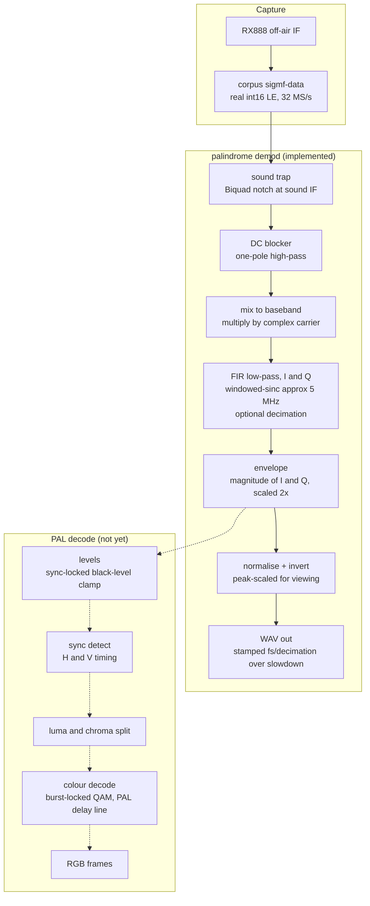

## PALindrome

Convert to and from PAL with a variety of techniques to try and capture that authentic 1980s/1990s vibe in your emulator.

## Capturing reference clips from an RX888

`tools/capture_corpus.py` grabs a short off-air clip from an RX888 mk2 and
saves it as a SigMF recording (raw IF samples plus metadata) under `corpus/`.
These are the lossless RF masters the decoders are tested against.

Needs on your `$PATH`:

- `rx888_stream`, built `--release` from the matt-main fork:
  https://github.com/mattgodbolt/rx888_stream/tree/matt-main
  (it has the FX3 shutdown and self-heal fixes).
- The FX3 firmware `.img` from that repo (passed with `--firmware`).
- `python3` with `numpy`.

Plug in the RX888, feed it the source RF, then from this directory:

```
python3 tools/capture_corpus.py wb3 \
  --firmware ~/dev/rx888_stream/SDDC_FX3_v22.img \
  --source "Sega Master System II, Wonder Boy III, UK PAL"
```

That writes `corpus/wb3.sigmf-data` and `corpus/wb3.sigmf-meta`. The first
argument is the clip name. Defaults: 32 MSps, 12 PAL frames, tuned 0.5 MHz
below the vision carrier with front-end-heavy gain. The detected vision,
chroma and sound carriers and the full capture recipe are written into the
`.sigmf-meta`.

Useful flags: `--sample-rate`, `--frequency`, `--vhf-lna`, `--vhf-vga`,
`--frames`, `--outdir`. Run with `--help` for the rest.

`corpus/*.sigmf-data` are large binaries, tracked with git LFS.

## Decoding: the `demod` command

`palindrome demod corpus/wb3 -o wb3.wav` AM-demodulates a recording's vision
carrier and writes the recovered composite envelope as a WAV. The envelope is
peak-normalised and polarity-inverted (sync to the bottom) for comfortable
viewing, and the WAV is stamped at `(sample_rate / decimation) / slowdown`
(default 1000x slowdown, no decimation) so it opens at audio rates in a viewer
like Audacity. It's a debugging/inspection tool while the decode is built up.

Useful flags: `--carrier`, `--cutoff` (default 5 MHz), `--decimate N` (keep one
output sample per N inputs, default 1), `--slowdown`, and `--no-sound-trap` /
`--sound-q` for the sound-carrier notch. Run with `--help` for the rest.



Each stage (`palindrome::dsp::Fir`, `palindrome::dsp::Biquad`,
`palindrome::demod::AmEnvelope`) is a streaming, span-based block: state carries
across calls, so the result is independent of how the input is chunked.

Known limitations of this first pass: the low-pass is a linear-phase FIR (some
pre-ringing); detection is a plain envelope (no synchronous/quasi-sync option
yet); and decimation is available (`--decimate N`) but off by default, so out of
the box it runs the full-rate convolution and isn't fast. The output is only
peak-normalised and polarity-inverted for viewing — proper sync-locked
black-level clamping comes with the sync/levels stage.

## Notes

### Dependencies

All third-party deps (Catch2, nlohmann_json, Lyra, lodepng) come in via CPM,
pinned by tag or commit, no system packages required. To prefer
system-installed copies (find_package first, fall back to CPM fetch) configure
with `-DCPM_USE_LOCAL_PACKAGES=ON` — that's CPM's own switch, and we use it
directly rather than wrapping it.

### SIMD (`std::simd`) — parked

The DSP hot loops (`dsp::convolve`, `demod::envelope_magnitude`) currently
vectorise via per-function `[[gnu::optimize(...)]]` to license FP reassociation
/ drop the `sqrt` errno+trapping guards. It's ODR-safe (anonymous-namespace,
single definition) and the precision loss is bounded and measured, but
`[[gnu::optimize]]` is a GCC debug-only feature we'd rather not ship.

Plan, when we pick this up: rewrite those loops in `std::simd` so the lane
reduction is explicit and **no** FP-relaxation flags/attributes are needed.

Blockers found (2026-05): `std::simd`'s `convolve` is validated working on GCC
16.1 and 17-trunk, but `simd.math` (`sqrt`) is **not** in shipping libstdc++ even
on trunk (gated behind GSI-HPC's `VIR_PATCH_MATH`); libc++ ships no `<simd>` at
all, so Clang has no path. The magnitude's `sqrt` would stay scalar (or
`std::experimental::simd`) until `simd.math` lands. Also needs GCC 16+ in the
build, which Ubuntu 25.10 / the toolchain PPA don't package — a Compiler
Explorer tarball is the likely route.
