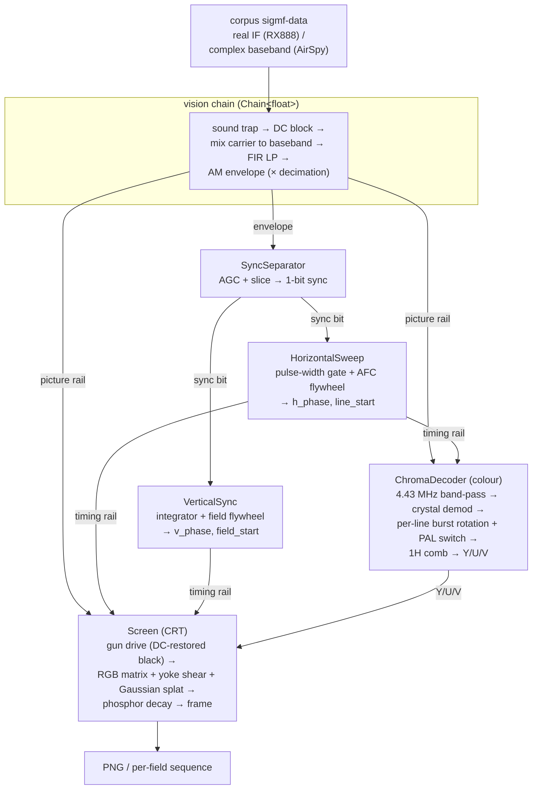

## PALindrome

Convert to and from PAL with a variety of techniques to try and capture that authentic 1980s/1990s vibe in your emulator.

## Where we're at

PALindrome ingests a lossless RF/IQ master of a real PAL source (captured off a
console via an SDR) and decodes it the way a 1980s television would — as an
analog machine, not a DSP textbook. The current state:

- **Capture** from an RX888 (real-sampled IF) or an AirSpy R2 (complex
  baseband), saved as SigMF masters under `corpus/`. Both decode through the
  same pipeline.
- **`demod`** — AM-demodulates the vision carrier to a WAV for inspection.
- **`render`** — a **working sync-locked decode, in colour** (`--colour`) or
  monochrome: a streaming video graph that separates sync, locks horizontal and
  vertical timebases with flywheel PLLs, decodes the PAL chroma (a faithful
  PAL-D channel — burst-locked crystal, PAL-switch ident, 1H comb), and paints the
  beam onto a phosphor screen modelled as an analog set — a rotated deflection
  yoke (straight scanlines), a Gaussian beam spot, and an electron gun whose
  cutoff is set by the DC-restored black level.
  Interlace falls out of the half-line field offset; `--frame-stride` dumps a
  per-field PNG sequence.
- **`tools/inspect_capture.py`** — fast capture QC: predicts whether a clip is
  decodable (carrier/sideband reach, line-comb SNR) and flags near-carrier ghost
  spurs, before you sink time into a full decode.
- **`tools/tune.py`** — a web UI (slider per knob, frame scrubber) that shells
  out to `render` so you can dial the decode/CRT/colour knobs in live. It lives
  outside the C++ core — the decoder stays a plain CLI with no webserver in it.
- **`sync`** — a diagnostic that slices the composite and reports the pulse-width
  distribution, line-sync jitter, vertical field structure, and the locks the
  timebases settle on. This is the microscope the decode was built with.

The picture is a clean, recognisable image — true blacks, straight geometry,
filled scanlines — and **in colour** (`render --colour`): a PAL-D chroma channel
recovers U/V off the burst and drives an RGB phosphor triad. Levels are period-
correct (an IF-AGC white reference, ACC chroma referenced to the luma, retrace
blanking), and the RGB matrix matches the TDA3561A datasheet. The burst gate is
calibrated per SDR (the AirSpy's narrow 10 MS/s puts the 4.43 MHz chroma near
Nyquist, where its front-end group delay shifts the burst ~2 µs vs the RX888's
wide 32 MS/s — a real capture characteristic, not a decoder gap). See the roadmap.

## Capturing reference clips

Two SDRs, two conventions. Both write a self-describing SigMF pair
(`<name>.sigmf-data` + `<name>.sigmf-meta`) under `corpus/`; the lossless RF/IQ
master is kept, not demodulated composite, so everything downstream is
reconstructible from it. `corpus/*.sigmf-data` are large binaries, tracked with
git LFS.

### RX888 (real-sampled IF)

`tools/capture_corpus.py` drives `rx888_stream` (the matt-main fork — see below).
Real samples, Nyquist `fs/2`; at 32 MSps the whole stack (vision IF ~3.6 MHz,
chroma +4.43, sound +6.0) fits with room to spare. Carriers are absolute IF bins
in the `rx888:*` metadata.

```
python3 tools/capture_corpus.py wb3 \
  --firmware ~/dev/rx888_stream/SDDC_FX3_v22.img \
  --source "Sega Master System II, Wonder Boy III, UK PAL"
```

Needs `rx888_stream` (built `--release` from
https://github.com/mattgodbolt/rx888_stream/tree/matt-main, with the FX3
shutdown/self-heal fixes), the FX3 firmware `.img`, and `python3` + `numpy`.
Defaults: 32 MSps, 12 frames, tuned ~0.5 MHz below the vision carrier with
front-end-heavy gain. Flags: `--sample-rate`, `--frequency`, `--vhf-lna`,
`--vhf-vga`, `--frames`, `--outdir`.

### AirSpy R2 (complex baseband)

`tools/capture_airspy.py` drives `airspy_rx` (stock firmware, no FX3 juggling).
Complex `ci16_le` IQ centred on the tune frequency, Nyquist ±fs/2. At 10 MSps the
span holds vision + chroma but **not** the +6 MHz sound, so the default tunes on
the vision carrier (vision + chroma, no sound). Carriers are **offsets from
`core:frequency`** in the `airspy:*` metadata — the opposite convention to the
RX888 corpus.

```
python3 tools/capture_airspy.py wb3 \
  --source "Sega Master System II, Wonder Boy III, UK PAL"
python3 tools/inspect_capture.py corpus/wb3   # QC before decoding
```

Needs `airspy_rx` (from `airspy-tools`) on `$PATH` and `python3` + `numpy` (+
`scipy`/`pillow` for `inspect_capture.py`). Defaults: 10 MSps, **gain 9**, 25
frames (1 s). Flags: `--frequency`, `--gain`, `--frames`, `--sample-rate`.

**Gain 9, not higher.** Counter-intuitively, a front-end-heavy gain (≥13)
overdrives the AirSpy's ADC into an intermodulation product: a coherent,
video-bearing *ghost* of the vision carrier ~fs/70 (~143 kHz) away, ~17 dB down.
It beats into the AM envelope as drifting vertical bars and renders the decode
unrecognisable — all while the ADC clip percentage reads 0%. `inspect_capture.py`
flags it; `g9` clears it with the best line-comb SNR. The decode itself works:
`render`/`demod`/`sync` read `ci16` and down-mix the carrier offset directly.

## Decoding

### `render` — the picture

`palindrome render corpus/wb3 -o /tmp/wb3.png` decodes a recording to a PNG.
The signal flows through a streaming, branching video graph modelled on the
analog set:



Every stage is a streaming block (`prepare` / `process(span)→span`, state carried
across calls), so the output is independent of how the input is chunked — a
tested invariant, because the target is live RF, not finite files. The whole
graph is a `video::Decoder` composite node; `render` just pumps it 64K-sample
blocks. Flags: `--width`, `--height`, `--decimate`, `--carrier`, `--cutoff`,
`--sync-cutoff` (the narrow low-pass on the sync-detection branch), and the CRT
knobs `--persistence` (phosphor decay, in field periods), `--beam-sigma`
(beam-spot vertical size, in rows), and `--frame-stride` (write a PNG every Nth
field as `<stem>_NNNN.png` instead of a single image).

For colour, add `--colour`: it decodes the chroma and writes an RGB PNG.
`--saturation` is the chroma gain (a fraction of the luma white — the colour pot)
and `--contrast` the white point; `--burst-lo`/`--burst-hi` place the burst gate
and `--h-blank` the retrace blanking, as h_phase windows (the defaults suit
~16 MS/s; a 10 MS/s AirSpy capture wants `--burst-lo 0.16 --burst-hi 0.20
--h-blank 0.21`, plus `--decimate 1 --cutoff 4.8e6` so the subcarrier survives
the front end). `--no-delay-line` drops the 1H comb. The subcarrier is a fixed
4.43361875 MHz crystal (override with `--subcarrier`); the per-line burst
rotation tracks the source's offset from it, exactly as a real set's APC does.

### `demod` — composite envelope to WAV (inspection)

`palindrome demod corpus/wb3 -o /tmp/wb3.wav` AM-demodulates the vision carrier
and writes the recovered composite envelope as a WAV (peak-normalised,
sync-to-the-bottom, slowed so it opens at audio rates in Audacity). A
debugging/inspection tool. Flags: `--carrier`, `--cutoff`, `--decimate`,
`--slowdown`, `--no-sound-trap`, `--sound-q`.

### `sync` — the timebase microscope

`palindrome sync corpus/wb3` slices the composite and reports the pulse-width
histogram (line-sync vs the vertical-interval broad/equalising pulses), the
line-sync spacing jitter, the vertical field structure (broad-pulse runs, field
period), and the horizontal/vertical locks. No picture — just the numbers that
tell you whether the sync chain is healthy.

### `tools/tune.py` — dialling the knobs

`tools/tune.py corpus/wb3_airspy` serves a web page with a slider for every
decode/CRT/colour knob (envelope cutoff, sync LP, persistence, beam sigma, gun
gamma, the horizontal/vertical hold PI loops, and the colour controls —
colour on/off, saturation, contrast, burst gate, retrace blanking, 1H comb) plus
a frame scrubber and play button. Moving a slider re-runs `render` and the page scrubs the per-field PNG
sequence it produces. It binds `0.0.0.0` by default so you can drive it from
another machine (`--host`, `--port`, `--binary` to override); it's
unauthenticated, so keep it to a trusted network. Every knob it offers is just a
`render` flag, so anything you settle on is reproducible from the CLI.

## Roadmap

- **A decent monochrome picture.** ✅ Done: gun-drive levels (DC-restored black),
  the rotated deflection yoke (straight scanlines), a Gaussian beam splat (filled
  scanlines), the electron-gun gamma, per-field snapshots, and a web-slider tuner
  (`tools/tune.py`) for dialling the knobs in.
- **Colour — the PAL bit.** ✅ Done (`render --colour`): a fixed 4.43 MHz crystal
  LO, per-line back-porch burst measurement, the class-aware PAL ± line rotation
  with a self-resolving V-switch (bistable + ident), the 1H delay-line comb, ACC
  chroma referenced to the luma white, an IF-AGC white reference, retrace
  blanking, and the RGB phosphor matrix — a faithful PAL-D path matching the
  TDA3561A datasheet (`docs/TDA3561A.md`). The burst gate is calibrated per SDR
  (`--burst-lo/-hi --h-blank`), and the reason is worth recording: a *uniform*
  front-end delay would cancel (it shifts the sync reference and the burst
  together), but the AirSpy R2's is *dispersive* — different frequencies are
  delayed by different amounts, so the 4.43 MHz burst lands ~2 µs later than the
  low-frequency sync edge and their spacing shifts. Both these RF captures went
  through a tuner (the RX888 mk2 used its R828D VHF path, `--vhf-*`, not its
  direct-sampling HF path), so it isn't tuner-vs-direct — it's bandwidth: the
  RX888's wide 32 MS/s keeps the chroma at ~0.5·Nyquist where the response is
  flat, while the AirSpy's narrow 10 MS/s puts it at 0.885·Nyquist, in the
  anti-alias roll-off where group delay climbs (and the upper sideband clips).
  Real PAL TVs add group-delay equalisers in the IF for exactly this reason. The
  skew is in the AirSpy *capture* (it survives full decoder bypass on the raw IQ),
  so one computed gate can't cover both radios; it's a real capture characteristic,
  not a missing feature. (Direct-sampling the composite baseband — feeding video
  straight to the ADC, no tuner — would sidestep this, but we haven't captured
  that way yet.)
- **Optimisation, then SIMD.** Profile the hot paths; revisit `std::simd` for the
  DSP loops (see the note below).
- **Multi-threading.** The streaming-block model is already structured for it.
- **Live mode.** The whole point: decode a live RF stream off the SDR, not just
  finite corpus files. The graph is bounded-memory and block-driven for exactly
  this.

## Notes

### Dependencies

All third-party deps (Catch2, nlohmann_json, Lyra, lodepng) come in via CPM,
pinned by tag or commit, no system packages required. To prefer system-installed
copies (find_package first, fall back to CPM fetch) configure with
`-DCPM_USE_LOCAL_PACKAGES=ON` — that's CPM's own switch, and we use it directly
rather than wrapping it.

### SIMD — non-standard now, `std::simd` later

Two DSP hot paths are hand-vectorised. Both are deliberately non-portable
stop-gaps, meant to become `std::simd` once the toolchain is there:

- **The FIR (`dsp::convolve_strip`)** uses **AVX2/FMA intrinsics**
  (`<immintrin.h>`, `_mm256_fmadd_ps`, …) to carry a strip of output samples in
  named vector accumulators across the tap loop, hiding the FMA-latency chain a
  single-accumulator dot product stalls on. It's guarded by
  `#if defined(__AVX2__) && defined(__FMA__)`; without those (non-x86, or no
  AVX2) the scalar `dsp::convolve` — a plain `std::fmaf` dot — is the fallback.
  Both sum taps in natural order, so the intrinsic and scalar paths are
  bit-identical and the result stays chunking-invariant.
- **The AM envelope (`demod::envelope_magnitude`)** uses a per-function
  `[[gnu::optimize("-fno-math-errno", "-fno-trapping-math")]]` so the `sqrt`
  lowers to a packed `vsqrtps` without the errno/trap guards. ODR-safe
  (anonymous-namespace, single definition) and the precision loss is bounded and
  measured — but `[[gnu::optimize]]` is a GCC debug-only feature.

x86-only intrinsics and a GCC-only attribute are both where we don't want to
stay. Plan, when we pick it up: rewrite both in `std::simd` so the lanes are
explicit and portable, needing no target intrinsics or FP-relaxation flags.

Blockers found (2026-05): `std::simd`'s `convolve` is validated working on GCC
16.1 and 17-trunk, but `simd.math` (`sqrt`) is **not** in shipping libstdc++ even
on trunk (gated behind GSI-HPC's `VIR_PATCH_MATH`); libc++ ships no `<simd>` at
all, so Clang has no path. The magnitude's `sqrt` would stay scalar (or
`std::experimental::simd`) until `simd.math` lands. Also needs GCC 16+ in the
build, which Ubuntu 25.10 / the toolchain PPA don't package — a Compiler
Explorer tarball is the likely route.
