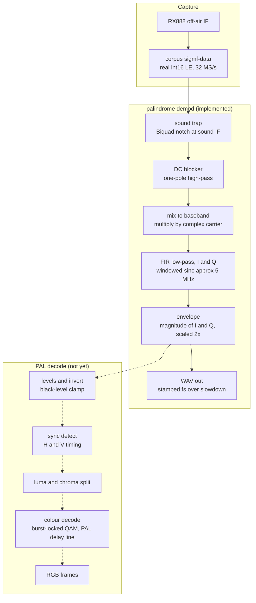

## PALindrome

Convert to and from PAL with a variety of techniques to try and capture that authentic 1980s/1990s vibe in your emulator.

## Capturing reference clips from an RX888

`tools/capture_corpus.py` grabs a short off-air clip from an RX888 mk2 and
saves it as a SigMF recording (raw IF samples plus metadata) under `corpus/`.
These are the lossless RF masters the decoders are tested against.

Needs on your `$PATH`:

- `rx888_stream`, built `--release` from the matt-main fork:
  https://github.com/mattgodbolt/rx888_stream/tree/matt-main
  (it has the FX3 shutdown and self-heal fixes).
- The FX3 firmware `.img` from that repo (passed with `--firmware`).
- `python3` with `numpy`.

Plug in the RX888, feed it the source RF, then from this directory:

```
python3 tools/capture_corpus.py wb3 \
  --firmware ~/dev/rx888_stream/SDDC_FX3_v22.img \
  --source "Sega Master System II, Wonder Boy III, UK PAL"
```

That writes `corpus/wb3.sigmf-data` and `corpus/wb3.sigmf-meta`. The first
argument is the clip name. Defaults: 32 MSps, 12 PAL frames, tuned 0.5 MHz
below the vision carrier with front-end-heavy gain. The detected vision,
chroma and sound carriers and the full capture recipe are written into the
`.sigmf-meta`.

Useful flags: `--sample-rate`, `--frequency`, `--vhf-lna`, `--vhf-vga`,
`--frames`, `--outdir`. Run with `--help` for the rest.

`corpus/*.sigmf-data` are large binaries, tracked with git LFS.

## Decoding: the `demod` command

`palindrome demod corpus/wb3 -o wb3.wav` AM-demodulates a recording's vision
carrier and writes the recovered composite envelope as a WAV, stamped at
`sample_rate / slowdown` (default 1000x) so it opens at audio rates in a viewer
like Audacity. It's a debugging/inspection tool while the decode is built up.



Each stage (`palindrome::dsp::Fir`, `palindrome::dsp::Biquad`,
`palindrome::demod::AmEnvelope`) is a streaming, span-based block: state carries
across calls, so the result is independent of how the input is chunked.

Known limitations of this first pass: the low-pass is a linear-phase FIR (some
pre-ringing); detection is a plain envelope (no synchronous/quasi-sync option
yet); and it runs the full-rate convolution with no decimation, so it's not
fast. The recovered envelope is still "negative" polarity (sync at the top) —
inversion and black-level clamping come with the sync/levels stage.
