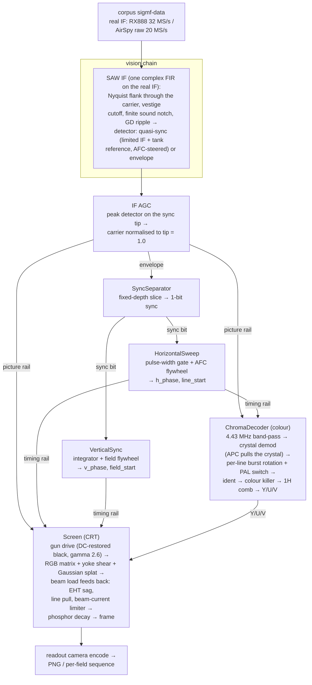

# PALindrome

Decoding real PAL RF, captured from a games console with an SDR, the way a
1980s television did it: as an analog machine, not a DSP textbook.


That's one second of Wonder Boy III: a Sega Master System II's RF modulator,
recorded losslessly through an AirSpy R2, decoded as a mid-80s set would have
done. The first few frames are the set locking on - the vertical hold
catches, then the colour fades up as the colour killer decides this really is
PAL. That's how switch-on looked; it's not a bug. Two caveats: the GIF is
10 fps and palette-dithered, where the decoder makes all 50 fields a second
and doesn't dither. It looks better in person. CRTs always did.

One day I'd like to encode back to PAL as well, for emulators - the `encode`
and `decode` subcommands are stubs for that. `render` is the working end.

## Where it's at

`render` turns a lossless RF master (SigMF files under `corpus/`, in git LFS)
into a picture; add `--colour` for colour. The masters come from an RX888 or
an AirSpy R2. Both are real-sampled IF and go through the same pipeline.

The chain is a television's. An IF filter with a SAW filter's shape, a
quasi-sync detector, and an AGC that levels the carrier off the sync tips.
Flywheel oscillators lock the horizontal and vertical timebases. The chroma
path is PAL-D: a burst-locked crystal, the PAL switch and its ident, a 1H
delay-line comb, a colour killer. The result drives a modelled CRT - a
slightly rotated deflection yoke, a Gaussian beam spot, an electron gun
biased at the DC-restored black level, gamma 2.6, overscan, EHT sag, a
beam-current limiter. Period behaviour is the default; the modern
conveniences hide behind flags.

There's also a live mode: point the AirSpy at the console and watch the
decode in a browser, in real time, in colour.



[docs/render.md](docs/render.md) walks the chain stage by stage, with every
flag, and a glossary for anyone whose shelf lacks a 1980s TV service manual.

## Building

Needs CMake 3.30+, Ninja, and g++-15 (pinned by `cmake/toolchains/gcc.cmake`;
the project is C++26). Third-party dependencies arrive via CPM - no system
packages. The `corpus/*.sigmf-data` masters are git-LFS objects, so
`git lfs pull` before decoding anything.

```
cmake --preset release && cmake --build --preset release
ctest --preset release
build/release/cli/palindrome render corpus/wb3_airspy --colour -o /tmp/wb3.png
```

Presets: `debug`, `release` (RelWithDebInfo, LTO, `-march=native`), and
`sanitize` (ASan+UBSan).

## The commands

`palindrome render corpus/wb3 --colour -o /tmp/wb3.png` decodes a recording
to a PNG, or to a per-field sequence with `--frame-stride`. The knobs are
documented in [docs/render.md](docs/render.md). There are a lot of them; a
television is mostly knobs.

`palindrome sync corpus/wb3` is the timebase microscope the decoder was built
with. It reports the pulse-width histogram, line-sync jitter, the field
structure, and what the timebases locked to. No picture, just numbers. It and
`demod` read through the plain low-pass front end rather than the SAW shape,
so they measure the signal, not the receiver.

`palindrome demod corpus/wb3 -o /tmp/wb3.wav` writes the demodulated
composite as a WAV, slowed 1000x (`--slowdown`) so Audacity will open it at
audio rates. A surprisingly pleasant way to stare at sync pulses.

`palindrome info corpus/wb3` says what a recording is: datatype, sample rate,
duration, capture metadata.

`tools/tune.py corpus/wb3_airspy` serves a web page with a slider per knob
and a frame scrubber; moving a slider re-runs `render`. Each slider is just a
`render` flag, so whatever you settle on works from the CLI too - the decoder
stays a plain CLI with no webserver in it. It binds `0.0.0.0` and has no
authentication, so keep it on a network you trust.

`tools/inspect_capture.py corpus/wb3` is capture QC: it predicts whether a
clip will decode (carrier and sideband reach, line-comb SNR) and flags
near-carrier ghost spurs, before you spend time on a full decode.

## Capturing

Reference clips are lossless RF masters: the whole modulated channel, as the
tuner would hand it to the IF strip, kept as SigMF pairs under `corpus/`.
`tools/capture_corpus.py` drives the RX888 and `tools/capture_airspy.py` the
AirSpy R2. [docs/capture.md](docs/capture.md) has the conventions, the tuning
arithmetic, and why the AirSpy gain stops at 9. What each existing clip is,
and which of its quirks the defaults are calibrated against, is in
[docs/corpus.md](docs/corpus.md).

## Live mode

`render --live` decodes a continuous real-int16 SDR stream from stdin. It
needs `--carrier`: the tuner's IF-plan target, in other words the channel
preset. The input stage puts the vision carrier there and the AFC absorbs the
drift, the same way a tuned set does - no set scans at switch-on. Decoded
frames leave as raw RGB writes on `--frame-fd`, so whoever owns that fd does
the image encoding and the decoder stays a plain CLI. `--frame-stride` sets
the snapshot cadence (default every 5th field, about 10 fps) and
`--deposit-threads 8` buys the real-time margin at 20 MS/s colour.

`tools/live_view.py` wires it up: it spawns
`airspy_rx -r /dev/stdout | palindrome render --live --frame-fd ...`,
JPEG-encodes the frames off the pipe, and serves an MJPEG stream a browser
will render in a plain ``. Run `tools/live_view.py --gain 9` and open
`http://localhost:8080`.

## Roadmap

The monochrome picture, colour, the threaded pipeline and live mode all work;
what remains is tracked as GitHub issues on this repo. Where the render time
goes, and which optimisations paid off or dead-ended, is in
[docs/performance.md](docs/performance.md). The plan for replacing the
hand-AVX2 stop-gaps with `std::simd` is in [docs/simd.md](docs/simd.md).

## Dependencies

Everything third-party (Catch2, nlohmann_json, Lyra, lodepng, and NVIDIA
stdexec for the threaded pipeline) comes in via CPM, pinned by tag or commit.
To prefer system-installed copies, configure with
`-DCPM_USE_LOCAL_PACKAGES=ON` - that's CPM's own switch and we use it as-is.
