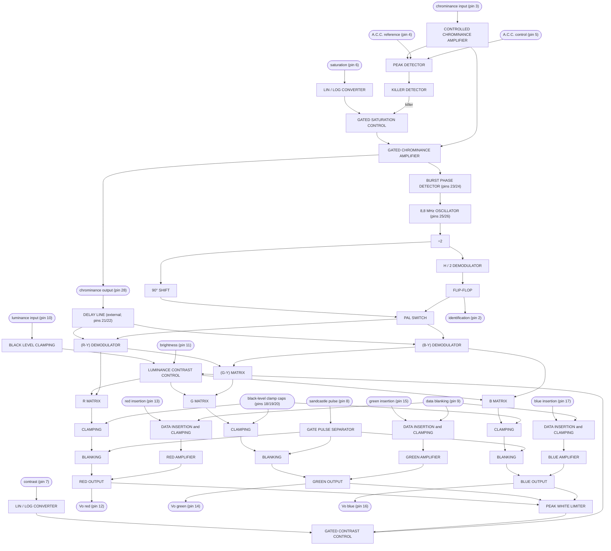
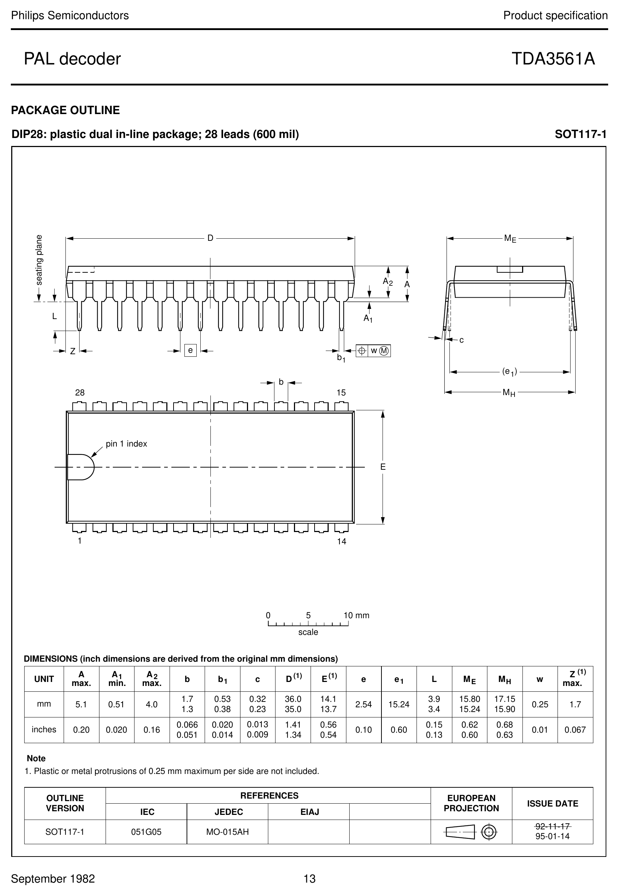

# TDA3561A - PAL decoder

> Transcribed from the local `docs/TDA3561A.PDF` (Philips Semiconductors
> **product specification**, *PAL decoder TDA3561A*, "File under Integrated
> Circuits, IC02", dated **September 1982**; 14 pages). The source PDF is an
> **image-only scan**, so this transcription was produced by rendering the pages
> at 240 dpi and reading them visually, supplemented by OCR (tesseract) of the
> body text. Values were cross-checked between the quick-reference table, the
> characteristics tables, the block diagram and the pin-by-pin application notes.
>
> Note that the original datasheet is itself internally inconsistent in a couple
> of places - the sandcastle (pin 8) thresholds and the burst-to-chroma ratio are
> printed with slightly different numbers in the tables versus the prose. Both
> forms are reproduced faithfully below; the discrepancy is in the source, not in
> this transcription.
>
> The mechanical **dimension table** in the package-outline drawing (page 13) is a
> degraded drawing in the scan and is not transcribed as numbers; the page-13
> drawing is instead linked as an image, and the package type and pitch are given.
> Everything else below is taken directly from the document.

---

## General description

The TDA3561A is a decoder for the PAL colour television standard. It combines all
functions required for the identification and demodulation of PAL signals.
Furthermore it contains a luminance amplifier, an RGB-matrix and amplifier. These
amplifiers supply output signals up to 5 V peak-to-peak (picture information)
enabling direct drive of the discrete output stages. The circuit also contains
separate inputs for data insertion, analogue as well as digital, which can be used
for text display systems (e.g. Teletext / broadcast antiope), channel-number
display, etc. Additional to the TDA3560, the circuit includes the following
features:

## Features

- The **peak white limiter** is only active during the time that the 9,3 V level
  at the output is exceeded. The start of the limiting function is delayed by one
  line period. This avoids peak white limiting by test patterns which have abrupt
  transitions from colour to white signals.
- The **brightness control** is obtained by inserting a variable pulse in the
  luminance channel. Therefore the ratio of brightness variation and signal
  amplitude at the three outputs is identical and independent of the difference in
  gain of the three channels. Thus discolouring due to adjustment of contrast and
  brightness is avoided.
- Improved suppression of the internal RGB signals when the device is switched to
  external signals, and vice versa.
- Non-synchronized external RGB signals do not disturb the black level of the
  internal signals.
- Improved suppression of the residual 4,4 MHz signal in the RGB output stages.
- Cascoded stages in the demodulators and burst phase detector minimize the
  radiation of the colour demodulator inputs.
- High current capability of the RGB outputs and the chrominance output.

> Note: this device is controlled by **analogue DC control voltages**
> (contrast on pin 7, brightness on pin 11, saturation on pin 6) - there is **no
> I²C bus** on the TDA3561A.

## Quick reference data

| Parameter | Symbol | Value | Unit |
|-----------|--------|-------|------|
| Supply voltage | V₁₋₂₇ | typ. 12 | V |
| Supply current | I₁ | typ. 85 | mA |
| Luminance input signal (peak-to-peak value) | V₁₀₋₂₇(p-p) | typ. 0,45 | V |
| Chrominance input signal (peak-to-peak value) | V₃₋₂₇(p-p) | 55 to 1100 | mV |
| Data input signals (peak-to-peak value) | V₁₃,₁₅,₁₇₋₂₇(p-p) | typ. 1 | V |
| RGB output signals at nominal contrast and saturation (p-p) | V₁₂,₁₄,₁₆₋₂₇(p-p) | typ. 5,25 | V |
| Contrast control range | | typ. 20 | dB |
| Saturation control range | | min. 50 | dB |
| Input voltage for data insertion | V₉₋₂₇ | min. 0,9 | V |
| Blanking input voltage | V₈₋₂₇ | typ. 1,5 | V |
| Burst gating and black-level gating input voltage | V₈₋₂₇ | typ. 7 | V |

## Package

28-lead DIL; plastic (**SOT117**); SOT117-1.

---

## Pinning

28-lead dual in-line plastic package (DIP28). Pin functions below are taken from
the block diagram (Fig.1) and the pin-by-pin application notes, which agree.
Supply is between pin 1 (+12 V) and pin 27 (0 V); all voltages in the data are
referenced to pin 27.

| Pin | Function |
|-----|----------|
| 1  | +12 V power supply (Vᴘ) |
| 2  | Identification / colour-killer control voltage (detection capacitor ≈330 nF) |
| 3  | Chrominance input |
| 4  | A.C.C. reference voltage / detector decoupling (≈330 nF; ≈4,9 V) |
| 5  | A.C.C. control-voltage decoupling (≈2,2 µF; ≈5 V) |
| 6  | Saturation control input |
| 7  | Contrast control input (also peak-white-limiter capacitor C2) |
| 8  | Sandcastle / field-blanking input (blanking + burst gating + black-level clamping) |
| 9  | Video/data switching (data blanking) input |
| 10 | Luminance signal input |
| 11 | Brightness control input |
| 12 | Red output |
| 13 | Red insertion (external R signal input) |
| 14 | Green output |
| 15 | Green insertion (external G signal input) |
| 16 | Blue output |
| 17 | Blue insertion (external B signal input) |
| 18 | Black-level clamp capacitor |
| 19 | Black-level clamp capacitor |
| 20 | Black-level clamp capacitor |
| 21 | (B−Y)/(R−Y) demodulator input (from external delay line) |
| 22 | (B−Y)/(R−Y) demodulator input (from external delay line) |
| 23 | Burst phase detector output / loop filter |
| 24 | Burst phase detector output / loop filter |
| 25 | Reference oscillator (output; frequency-counter test point) |
| 26 | Reference oscillator (input; variable capacitor C1) |
| 27 | Ground / negative supply (0 V) |
| 28 | Chrominance amplifier output (to external delay line) |

---

## Block diagram (Fig.1)

*Mermaid equivalent of Fig.1 in the original (a single-page schematic-style block
diagram), using the data sheet's own block names. The "DATA INSERTION & CLAMPING"
blocks are written "DATA INSERTION and CLAMPING" here only so the diagram renders;
the original uses "&". The chrominance amplifier output (pin 28) drives an external
1H glass delay line whose direct and delayed signals return on pins 21/22 to the
(R−Y) and (B−Y) demodulators. The A.C.C. detection on pins 4 and 5 is shown
schematically; in the original the peak detector is fed from the controlled
chrominance amplifier with the pin-4/pin-5 capacitors as reference/decoupling.*

---

## Ratings (limiting values)

Limiting values in accordance with the Absolute Maximum Rating System (IEC 134).

| Parameter | Symbol | Value | Unit |
|-----------|--------|-------|------|
| Supply voltage | Vᴘ = V₁₋₂₇ | max. 13,2 | V |
| Total power dissipation (see also Fig.2) | Pₜₒₜ | max. 1,7 | W |
| Storage temperature range | T_stg | −25 to +150 | °C |
| Operating ambient temperature range | T_amb | −25 to +65 | °C |

### Thermal resistance

| Parameter | Symbol | Value | Unit |
|-----------|--------|-------|------|
| From junction to ambient | Rth(j-a) | 50 | K/W |

---

## Characteristics

Vᴘ = V₁₋₂₇ = 12 V; T_amb = 25 °C; unless otherwise specified.

### Supply

| Parameter | Symbol | Min. | Typ. | Max. | Unit |
|-----------|--------|------|------|------|------|
| Supply voltage | Vᴘ = V₁₋₂₇ | 8 | 12 | 13,2 | V |
| Supply current | | | 85 | 115 | mA |
| Total power dissipation | Pₜₒₜ | | 1,0 | 1,4 | W |

### Luminance input (pin 10)

| Parameter | Symbol | Min. | Typ. | Max. | Unit |
|-----------|--------|------|------|------|------|
| Input voltage (peak-to-peak value); note 1 | V₁₀₋₂₇(p-p) | | 0,45 | | V |
| Input level before clipping | V₁₀₋₂₇ | | | 2 | V |
| Input current; input level 2 V, clamp not active | I₁₀ | | 0,15 | 1 | µA |
| Contrast control range (see Fig.3) | | | −17 to +3 | | dB |
| Control voltage for 40 dB attenuation | V₇₋₂₇ | | 1,2 | | V |
| Input current contrast control at V₇₋₂₇ = 3 V | I₇ | | | 10 | µA |

### Chrominance amplifier

| Parameter | Symbol | Min. | Typ. | Max. | Unit |
|-----------|--------|------|------|------|------|
| Input voltage (peak-to-peak value); note 2 | V₃₋₂₇(p-p) | 55 | 550 | 1100 | mV |
| Input impedance | \|Z₃₋₂₇\| | 6 | 9 | 12 | kΩ |
| Input capacitance | C₃₋₂₇ | | 4 | 6 | pF |
| A.C.C. control range | | 30 | | | dB |
| Change of burst signal at output over whole control range | | | | 1,5 | dB |
| Gain at nominal contrast/saturation, pin 3 to pin 28; note 3 | | 32 | | | dB |
| Output signal (p-p) at nominal contrast/saturation; burst 0,5 V p-p | V₂₈₋₂₇(p-p) | | 1,7 | | V |
| Maximum output voltage (p-p), R_L = 2 kΩ | V₂₈₋₂₇(p-p) | | 4,0 | | V |
| Distortion at V₂₈₋₂₇(p-p) = 2 V up to V₃₋₂₇(p-p) = 1 V | d | | 1,5 | 5 | % |
| Frequency response between 0 and 5 MHz | | | | −2 | dB |
| Saturation control range (see Fig.4) | | 50 | | | dB |
| Input current saturation control at V₆₋₂₇ = 3 V | I₆ | | | 15 | µA |
| Tracking between luminance and chrominance with contrast control over a range of 10 dB | | | | 2 | dB |
| Cross-coupling between luminance and chrominance amplifier; note 10 | | | | −46 | dB |
| Signal-to-noise ratio at nominal input signal; note 11 | S/N | 56 | | | dB |
| Phase shift between burst and chrominance at nominal contrast/saturation | Δφ | | | ±5 | ° |
| Output impedance of chrominance amplifier | \|Z₂₈₋₂₇\| | | 25 | | Ω |
| Maximum output current | I₂₈ | | | 15 | mA |

### Reference part

**Phase-locked loop**

| Parameter | Min. | Typ. | Max. | Unit |
|-----------|------|------|------|------|
| Catching range; note 4 | 500 | 700 | | Hz |
| Phase shift; note 5 | | | 5 | ° |

**Oscillator**

| Parameter | Symbol | Min. | Typ. | Max. | Unit |
|-----------|--------|------|------|------|------|
| Temperature coefficient of oscillator frequency; note 4 | | | −1,5 | | Hz/K |
| Frequency deviation for Vᴘ changing from 10 to 13,2 V; note 4 | | | 40 | | Hz |
| Input resistance (pin 26) | R₂₆₋₂₇ | 260 | 340 | 420 | Ω |
| Input capacitance (pin 26) | C₂₆₋₂₇ | | | 10 | pF |
| Output resistance (pin 25) | R₂₅₋₂₇ | 100 | 150 | 200 | Ω |
| Output voltage (peak-to-peak value; pin 25) | V₂₅₋₂₇(p-p) | | 700 | | mV |

**A.C.C. generation**

| Parameter | Symbol | Typ. | Unit |
|-----------|--------|------|------|
| Reference voltage (pin 4) | V₄₋₂₇ | 4,9 | V |
| Control voltage at nominal input signal (pin 2) | V₂₋₂₇ | 5,1 | V |
| Control voltage without chrominance input (pin 2) | V₂₋₂₇ | 2,65 | V |
| Colour-off voltage (pin 2) | V₂₋₂₇ | 3,15 | V |
| Colour-on voltage (pin 2) | V₂₋₂₇ | 3,4 | V |
| Identification-on voltage (pin 2) | V₂₋₂₇ | 1,9 | V |
| Change in burst amplitude with supply voltage (±10%) | | proportional | |
| Change in burst amplitude with temperature | | typ. 0,1; max. 0,25 | %/K |
| Voltage at pin 5 at nominal input signal | V₅₋₂₇ | 5 | V |

### Demodulator part

| Parameter | Symbol | Value | Unit |
|-----------|--------|-------|------|
| Input burst signal amplitude (p-p) between pins 21 and 22; note 6 | V₂₁₋₂₂(p-p) | typ. 100 | mV |
| Input impedance between pins 21 and 22 | \|Z₂₁₋₂₂\| | typ. 2 | kΩ |
| Ratio of demodulated signals (equal inputs at pins 21 and 22) - (B−Y)/(R−Y) | V₁₆₋₂₇ | typ. 1,78 ±10% | |
| Ratio - (G−Y)/(R−Y), no (B−Y) signal | V₁₄₋₂₇ | typ. −0,51 ±10% | |
| Ratio - (G−Y)/(B−Y), no (R−Y) signal | V₁₄₋₂₇ | typ. −0,19 ±25% | |
| Frequency response between 0 and 1 MHz | | −3 | dB |
| Cross-talk between colour demodulated signals | | > 40 | dB |
| Phase difference between (R−Y) signal and (R−Y) reference signal | | < 5 | ° |
| Phase difference between (R−Y) and (B−Y) reference signals | | typ. 90 (85 to 95) | ° |

### R.G.B. matrix and amplifiers

| Parameter | Symbol | Min. | Typ. | Max. | Unit |
|-----------|--------|------|------|------|------|
| Output voltage (p-p) at nominal luminance/contrast (black to white); note 3 | V₁₂,₁₄,₁₆₋₂₇(p-p) | 4,5 | 5,4 | 6,3 | V |
| Output voltage (p-p) of RED channel at nominal contrast/saturation, no luminance, (R−Y) signal | V₁₂₋₂₇(p-p) | 3,7 | 5,25 | 6,7 | V |
| Maximum peak white level; note 7 | | 9,0 | 9,3 | 9,6 | V |
| Maximum output current | I₁₂,₁₄,₁₆ | | | 15 | mA |
| Black level at output for brightness control voltage of 2 V | V₁₂,₁₄,₁₆₋₂₇ | | 2,6 | | V |
| Difference in black level between the three channels at output level 3 V; note 8 | ΔV | | | 200 | mV |
| Black level shift with vision contents | | | | 40 | mV |
| Input current brightness control | I₁₁ | | | 50 | µA |
| Variation of black level with temperature | ΔV | | 0,38 | 1,0 | mV/K |
| Variation of black level with contrast control | ΔV | | 10 | 200 | mV |
| Relative spread between the R, G and B output signals | | | | 10 | % |
| Relative black-level variation between channels during contrast/supply variation | | | 0 | 20 | mV |
| Differential black-level drift over a temperature range of 40 °C | | | 0 | 20 | mV |
| Blanking level at the RGB outputs | | 1,9 | 2,1 | 2,3 | V |
| Difference in blanking level of the three channels | | | 0 | | mV |
| Differential blanking-level drift over a temperature range of 40 °C | | | 0 | | mV |
| Tracking of output black level with supply voltage, (ΔV₀/V₀)/(ΔVᴘ/Vᴘ) | | | 1,1 | | |
| Signal-to-noise ratio of output signals; note 11 | S/N | 62 | | | dB |
| Residual 4,4 MHz signal at RGB outputs (p-p) | | | 40 | 150 | mV |
| Residual 8,8 MHz signal and higher harmonics at RGB outputs (p-p) | | | 75 | 150 | mV |
| Output impedance of RGB outputs | \|Z₁₂,₁₄,₁₆₋₂₇\| | | 50 | | Ω |
| Frequency response of total luminance and RGB amplifier circuits, f = 0 to 5 MHz | | | | −3 | dB |

### Signal insertion (pins 13, 15 and 17)

| Parameter | Symbol | Min. | Typ. | Max. | Unit |
|-----------|--------|------|------|------|------|
| Input signals (p-p) for an RGB output voltage of 5 V p-p | V₁₃,₁₅,₁₇₋₂₇(p-p) | 0,85 | 1 | 1,1 | V |
| Difference between black levels of RGB signals and inserted signals at output; note 9 | ΔV | | | 260 | mV |
| Output rise time | tr | | 40 | 80 | ns |
| Differential delay time for the three channels | td | | 0 | 40 | ns |
| Input current | I₁₃,₁₅,₁₇ | | | 10 | µA |

### Data blanking (pin 9)

| Parameter | Symbol | Value | Unit |
|-----------|--------|-------|------|
| Input voltage for no data insertion | V₉₋₂₇ | < 0,4 | V |
| Input voltage for data insertion | V₉₋₂₇ | > 0,9 | V |
| Maximum input voltage | V₉₋₂₇ | < 3 | V |
| Delay of data blanking | td | < 20 | ns |
| Input current | I₉ | < 35 | µA |
| Input impedance | \|Z₉₋₂₇\| | typ. 10 | kΩ |
| Suppression of internal RGB signals when V₉₋₂₇ > 0,9 V | | > 46 | dB |

### Sandcastle input (pin 8)

| Parameter | Symbol | Value | Unit |
|-----------|--------|-------|------|
| Level at which the RGB blanking is activated | V₈₋₂₇ | typ. 1,5 (1 to 2) | V |
| Level at which burst gating and clamping pulse are separated | V₈₋₂₇ | typ. 7,0 (6,5 to 7,5) | V |
| Delay between black-level clamping and burst-gating pulse | td | typ. 0,4 | µs |
| Input current, V₈₋₂₇ = 0 to 1 V | −I₈ | < 1 | mA |
| Input current, V₈₋₂₇ = 1 to 8,5 V | I₈ | typ. 20 | µA |
| Input current, V₈₋₂₇ = 8,5 to 12 V | I₈ | < 2 | mA |

### Notes to the characteristics

1. Signal with the negative-going sync; amplitude includes sync pulse amplitude.
2. Indicated is a signal for a colour bar with 75% saturation, so the chrominance
   to burst ratio is 2,2 : 1.
3. Nominal contrast is specified as the maximum contrast −3 dB and nominal
   saturation as the maximum saturation −6 dB.
4. All frequency variations are referred to the 4,4 MHz carrier frequency.
5. For ±400 Hz deviation of the oscillator frequency.
6. These signal amplitudes are determined by the a.c.c. circuit of the reference
   part.
7. When this level is exceeded, the amplitude of the output signal is reduced via
   a discharge of the capacitor at pin 7 (contrast control). The start of the peak
   white limiting action has a delay of one line period.
8. The variation of the black level depends directly on the gain of each channel
   during brightness control in the three channels. As a consequence, the black
   levels at the outputs (for output levels above or below 3 V) can have a
   difference which exceeds 200 mV. Because the amplitude and the black-level
   change with brightness control have a direct relationship, no discolouring can
   occur, caused by adjustment of contrast and brightness.
9. This difference occurs when the source impedance of the data signal inputs is
   150 Ω and the black-level clamp pulse duration is 4 µs (sandcastle pulse). A
   lower difference is obtained when the impedance is lower.
10. Cross-coupling is measured under the following condition: input signals
    nominal, contrast and saturation such that nominal output signals are obtained.
    The signals at the output at which no signal should be available must be
    compared with the nominal output signal at that output.
11. The signal-to-noise ratio is specified as peak-to-peak signal with respect to
    r.m.s. noise.

---

## Figures

The data sheet contains the following figures:

- **Fig.1** - Block diagram (reproduced as the Mermaid flowchart above).
- **Fig.2** - Power derating curve (P_tot vs T_amb).
- **Fig.3** - Contrast control voltage range (relative gain vs V₇₋₂₇).
- **Fig.4** - Saturation control voltage range (relative gain vs V₆₋₂₇).
- **Fig.5** - Brightness control voltage range (black level at RGB outputs vs
  V₁₁₋₂₇).
- **Fig.6** - Application circuit (see below).

---

## Application information

### Application circuit (Fig.6)

A typical PAL colour-TV front-end built around the TDA3561A:

- Composite video (2,7 V p-p) feeds a 270 ns luminance delay line and a 4,4 MHz
  trap in the luminance signal line, into the luminance input (pin 10).
- The chrominance signal is taken via a 4,4 MHz chrominance bandpass filter to the
  chrominance input (pin 3); the chroma amplifier output (pin 28) drives the
  external glass delay line, whose direct and delayed signals return on pins
  21/22.
- 8,8 MHz crystal/oscillator network on pins 25/26 with frequency trimmer.
- Contrast (pin 7), brightness (pin 11) and saturation (pin 6) potentiometers from
  the +12 V rail.
- Sandcastle / field-blanking pulse into pin 8; beam-current limiting using BAW62
  diodes.
- RGB outputs (pins 12/14/16) drive the picture-tube output stages; external RGB
  insertion on pins 13/15/17 with the data/blanking switch on pin 9.
- +12 V supply (pin 1), 0 V (pin 27), black-level clamp capacitors (≈100 nF) on
  pins 18/19/20.

**Adjustments (see Fig.6):**

- **C1** - 8,8 MHz oscillator (frequency trimmer).
- **L1** - phase delay line, 10,7 µH.
- **L2** - nominal value 10,7 µH.
- **L3** - 4,4 MHz chrominance input filter, 10,7 µH (= L1).
- **L4** - 4,4 MHz trap in luminance signal line, 5,6 µH.
- **L5** - delay equalization, 66,1 µH.
- **P1** - amplitude of direct chroma signal.
- **R1/R2** - set the field-blanking amplitude: R1/(R1+R2) × field-blanking
  amplitude = 2,0 V to 6,5 V.
- For a video input voltage of 1 V peak-to-peak: R3 can be omitted; R4 = 1 kΩ; R5
  must be short-circuited; R6 = 1 kΩ.

### Pin-by-pin functional description

When the saturation control pin is connected to the supply, the colour-killer
circuit is overruled so that the colour signal is visible on the screen; this
allows the oscillator frequency to be adjusted without a frequency counter (see
also pins 25 and 26).

- **1 - +12 V power supply.** Good operation over a supply range 8 to 13,2 V,
  provided the supply for the controls equals the supply for the TDA3561A. All
  signal and control levels depend linearly on the supply voltage. The current at
  12 V is typically 85 mA and is linearly dependent on the supply voltage.
- **2 - Identification control voltage.** Requires a detection capacitor of about
  330 nF. The voltages under various signal conditions are given in the
  characteristics.
- **3 - Chrominance input.** The chroma signal must be a.c.-coupled. Amplitude
  between 55 mV and 1100 mV p-p (25 mV to 500 mV p-p burst). Figures are based on a
  colour-bar signal with 75% saturation, i.e. a burst-to-chroma ratio of 1 : 2,25.
- **4 - Reference voltage / A.C.C. detector.** Decoupled by a capacitor of about
  330 nF; the voltage is 4,9 V.
- **5 - A.C.C. control voltage.** The A.C.C. is obtained by synchronous detection
  of the burst followed by a peak detector, giving good noise immunity and
  preventing an increase of colour for weak input signals. Recommended capacitor
  2,2 µF.
- **6 - Saturation control.** Range in excess of 50 dB; control-voltage range
  2 to 4 V; linear. When the colour killer is active the saturation control voltage
  is reduced to a low level if the external network resistance is high enough; the
  chroma amplifier then supplies no signal to the demodulator. Colour switch-on can
  be delayed by choice of the saturation control time constant.
- **7 - Contrast control.** Range 20 dB for a control-voltage change from +2 to
  +4 V; linear. The output is suppressed when the control voltage is 1 V or less.
  If one or more outputs surpass 9 V the peak-white-limiter circuit becomes active
  and reduces the output via discharging C2.
- **8 - Sandcastle and field-blanking input.** Outputs are blanked if the input
  pulse amplitude is between 2 and 6,5 V. The burst gate and clamping circuits are
  activated if the input pulse exceeds 7,5 V. The higher part of the sandcastle
  pulse should start just after the sync pulse to prevent clamping of the video
  signal on the sync pulse; the width should be about 4 µs for proper operation.
- **9 - Video/data switching.** The insertion circuit is activated by an input
  pulse between 1 V and 2 V; the internal RGB signals are then switched off and the
  inserted signals are supplied to the output amplifiers. For normal-only operation
  this pin should be connected to the negative supply. Switching times are very
  short (< 20 ns) to avoid coloured edges of the inserted signals on the screen.
- **10 - Luminance signal input.** The input signal should have a p-p amplitude of
  0,45 V (peak white to sync) to obtain a black-white output of 5 V at nominal
  contrast. A.c.-coupled by a capacitor of about 22 nF; clamped at the input to an
  internal reference. A 1 kΩ luminance delay line can be applied because the
  luminance input impedance is made very high, so the charge/discharge currents of
  the coupling capacitor are very small and the coupling capacitor may be small.
- **11 - Brightness control.** The black level of the RGB outputs is set by the
  voltage on this pin (Fig.5). The black level can be set higher than 4 V, but then
  the available output signal amplitude is reduced (see pin 7). Brightness control
  also operates on the black level of the inserted signals.
- **12, 14, 16 - RGB outputs.** Identical output circuits for red, green and blue.
  Output signals are 5,25 V at nominal input signals and control settings; the
  black levels of the three outputs have the same value; the blanking level is
  2,1 V. The peak white level is limited to 9,3 V; when exceeded, the output
  amplitude is reduced via the contrast control (pin 7).
- **13, 15, 17 - Inputs for external RGB signals.** The external signals must be
  a.c.-coupled via a coupling capacitor of about 100 nF; source impedance should
  not exceed 150 Ω. The input required for a 5 V p-p output signal is 1 V p-p. At
  the RGB outputs the black level of the inserted signal is identical to that of
  normal RGB signals. When these inputs are not used the coupling capacitors must
  be connected to the negative supply.
- **18, 19, 20 - Black-level clamp capacitors.** One per channel; about 100 nF
  each.
- **21, 22 - Inputs of the (B−Y) and (R−Y) demodulators.** The input signal is
  automatically fixed to the required level by the burst phase detector and A.C.C.
  generator connected to pins 21 and 22. As the burst (applied differentially to
  these pins) is kept constant by the A.C.C., the colour-difference signals
  automatically have the correct value.
- **23, 24 - Burst phase detector outputs.** The output of the burst phase
  detector is filtered here and controls the reference oscillator; an adequate
  catching range is obtained with the time constants given in the application
  circuit (Fig.6).
- **25, 26 - Reference oscillator.** The oscillator frequency is adjusted by the
  variable capacitor C1. For frequency adjustment, interconnect pins 21 and 22; the
  frequency can be measured by connecting a frequency counter to pin 25.
- **28 - Output of the chroma amplifier.** Both burst and chroma signals are
  available. The burst-to-chroma ratio at the output is identical to that at the
  input for nominal control settings; the burst is not affected by the controls.
  The amplitude of the signal applied to the demodulator is kept constant by the
  A.C.C., so the output at pin 28 depends on the signal loss in the delay line.

---

## Package outline

- **DIP28** - plastic dual in-line package; 28 leads (600 mil); **SOT117-1**.
- Lead pitch 2,54 mm (0,1 in); row spacing 600 mil (15,24 mm).
- Note: plastic or metal protrusions of 0,25 mm maximum per side are not included
  in the dimensions.

The scaled mechanical drawing and full mm/inch dimension table from page 13 of the
data sheet (its numerals are part of the scanned drawing and are not transcribed as
text here):

---

## Other sections in the source PDF

- **Soldering** (page 14): wave/dip soldering - max. solder temperature 260 °C,
  not in contact with the joint for more than 5 s; total contact time of
  successive solder waves max. 5 s; the device may be mounted up to the seating
  plane but the plastic body must not exceed T_stg max. Repairing soldered joints:
  soldering iron < 24 V applied to the leads below the seating plane (or ≤ 2 mm
  above it); iron tip < 300 °C may stay in contact up to 10 s, between 300 and
  400 °C up to 5 s.
- **Definitions** and **Life support applications** disclaimer (page 14): standard
  Philips Semiconductors boilerplate (data-sheet status, limiting-values
  statement, application-information advisory, life-support disclaimer).
